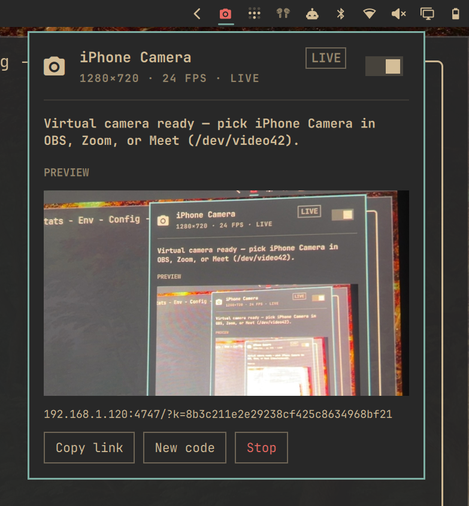

# iOSCam for Omarchy



Use the **back or front camera of an iPhone** as a webcam on [Omarchy](https://omarchy.org/) Linux; the same idea as Continuity Camera on a Mac.

The phone is the lens. Linux apps see a normal camera named **iPhone Camera**. No App Store app: scan a QR code, trust a profile once, and Safari streams the back camera.

**Tailscale is required.** The computer and the iPhone must both be on the same [Tailscale](https://tailscale.com) tailnet. The daemon listens on its Tailscale address only, so the local Wi-Fi network never sees the camera ports, and everything travels inside WireGuard on top of the daemon's own TLS.

This is **not** Apple’s Continuity Camera protocol (that needs an Apple ID, AWDL, and a Mac). It is the closest thing that works on Linux.

 

## Install

Before anything else, have Tailscale running on the computer (`tailscale up`) and install the [Tailscale app](https://apps.apple.com/app/tailscale/id1470499037) on the iPhone, logged in to the same tailnet.

```sh
omarchy plugin add https://github.com/boraoku/iOSCamForOmarchyLinux.git --enable
```

Then create the virtual webcam (password once):

```sh
~/.config/omarchy/plugins/io.github.boraoku.ioscam/setup
```

That installs any missing packages (`ffmpeg`, `v4l2loopback`, …), starts a user service, and adds a V4L2 loopback device labelled **iPhone Camera**.

Move the bar icon if you want:

```sh
omarchy bar move io.github.boraoku.ioscam --section right
```

## Use it

1. Click the camera icon in the Omarchy bar and turn it on. The QR code appears once Tailscale is connected on the computer.
2. Turn on Tailscale on the iPhone, then scan the QR code with the Camera app.
3. **First time only**
   - Tap **Install trust profile**
   - On the iPhone: **Settings → General → About → Certificate Trust Settings** → enable **Omarchy iPhone Camera**
   - Safari will not give the page the camera until that root is trusted
4. Tap **Open camera**, allow camera access, tap **Start back camera**.
5. Keep Safari in the foreground and the phone unlocked.
6. In Zoom, Google Meet, OBS, Discord, Chromium, or Firefox pick **iPhone Camera**.

### Bar shortcuts

| Input | Action |
| --- | --- |
| Left click | Open / close the panel |
| Right click | Start / stop the daemon |
| Middle click | Refresh |
| `c` | Copy the pairing link |
| `n` | New pairing code (forgets every paired phone) |
| `s` | Set up the virtual camera |
| Esc | Close |

## How it works

- A small Python daemon (stdlib only) serves an HTTP pairing page (`:4747`) and an HTTPS capture page (`:4748`), bound to the computer's Tailscale address only.
- Safari captures the **back** camera and sends 1280×720 JPEG frames over a WebSocket.
- The daemon repeats the latest frame at a steady 24 fps into `ffmpeg`, which writes a constant-size YUV stream to a `v4l2loopback` device.
- The QR code carries a **one-time pairing code** in the URL fragment, which the phone never sends over the network. The landing page redeems it over HTTPS for a session cookie; only that cookie lets a phone open the camera page and stream. Codes expire after 10 minutes or on first use.
- **New code** in the panel forgets every paired phone and issues a fresh QR.
- Status and control never leave the machine: the panel reads a status file and a Unix socket in `$XDG_RUNTIME_DIR`, both `0700`. Nothing on the network reports the daemon's state.
- The plaintext HTTP port serves only the static landing page and the public CA certificate; it accepts no credentials and no WebSocket.
- Input from the phone is bounded before it is read: a WebSocket message is capped at 2 MiB (4 KiB for text), frames must be well-formed masked WebSocket frames, at most 16 connections are open at once, and every image must parse as a JPEG between 16 and 4096 pixels a side before it reaches ffmpeg.

### Why Tailscale only

- The daemon asks the local `tailscale` CLI for this node's IPv4 (a Unix-socket query to `tailscaled`, never a network lookup). The address must lie in `100.64.0.0/10` and must be present on a local interface, or it is ignored.
- Both listeners bind to that address alone. Nothing is reachable from the Wi-Fi network, not even the pairing page.
- If Tailscale is not connected, the daemon waits and the panel says so. It never falls back to another interface. If the Tailscale address changes, the daemon restarts itself and re-issues its certificate for the new address.
- Only the Tailscale IP and the MagicDNS name are advertised, and the QR code uses the IP.

Wired use: plug the iPhone in and enable **Personal Hotspot → USB**. Tailscale routes over the cable on its own; the QR code does not change.

## Requirements

- Omarchy 4 (Quickshell bar)
- **Tailscale** on the computer and on the iPhone, both on the same tailnet
- iPhone with Safari (iOS 15+)
- `ffmpeg`, `openssl`, `qrencode`, `v4l2loopback-dkms`, `v4l2loopback-utils`
- Optional: `libimobiledevice` (ships with Omarchy) so the panel can notice a USB-connected iPhone

## What it does not do

- Capture while the iPhone is locked (Safari cannot keep the camera in the background)
- Center Stage, Studio Light, or Desk View (those are Apple-only)
- A native iOS app; on purpose, so nothing has to come from the App Store

## Remove

```sh
~/.config/omarchy/plugins/io.github.boraoku.ioscam/setup --uninstall
omarchy plugin remove io.github.boraoku.ioscam
```

## License

MIT. See [LICENSE](LICENSE).
